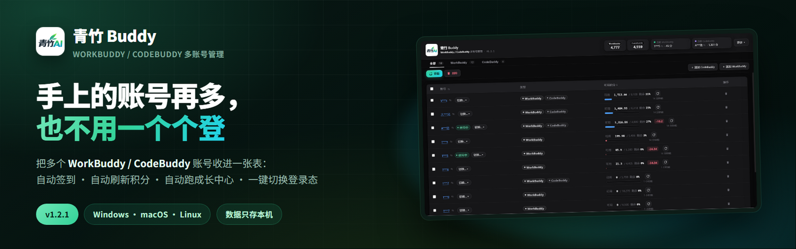

<div align="center">



# 🎋 青竹 Buddy

**多账号，用一扇窗管清楚。**

把多个 WorkBuddy / CodeBuddy 账号收进一张表 —— 自动签到、自动刷新积分、自动跑成长中心，要切账号一键搞定。

[](https://github.com/qingzhu-ai-public/workbuddy-account-manager-public/releases/latest)
[](https://github.com/qingzhu-ai-public/workbuddy-account-manager-public/releases)
[](LICENSE)
[]()
[](https://github.com/qingzhu-ai-public/workbuddy-account-manager-public/stargazers)

**[🌐 产品官网](https://qingzhu-ai-public.github.io/workbuddy-account-manager-public/)** ·
**[⬇️ 下载最新版](https://github.com/qingzhu-ai-public/workbuddy-account-manager-public/releases/latest)** ·
**[📦 全部版本](https://github.com/qingzhu-ai-public/workbuddy-account-manager-public/releases)** ·
**[💬 问题反馈](https://github.com/qingzhu-ai-public/workbuddy-account-manager-public/issues)**

</div>

> 手上有几个、十几个账号的人都在做同一件事：每天早上挨个打开官网，看积分、点签到、试到底哪个还能用。**青竹 Buddy 把这堆重复劳动收进一个本地桌面工具里**，一次配置，之后丢进托盘就不用管了。
>
> 👤 作者：[青竹 AI](https://github.com/qingzhu-ai-public) · 📦 仓库：[github.com/qingzhu-ai-public/workbuddy-account-manager-public](https://github.com/qingzhu-ai-public/workbuddy-account-manager-public)

> [!IMPORTANT]
> **📦 本仓库是发行仓，不含源码。** 这里只放产品介绍与安装包：源码在私有仓，安装包由私有仓的 GitHub Actions 跨平台构建后自动推送过来，**版本号与私有仓完全同步**。下载请直接去 [Releases](https://github.com/qingzhu-ai-public/workbuddy-account-manager-public/releases)，不用 Clone。

---

## ✨ 特性

| | 特性 |
|:---:|---|
| 🗂️ | **一张表管两端** —— WorkBuddy 与 CodeBuddy 共用同一份账号库，按端自动分类，顶部实时汇总两边总积分 |
| ➕ | **三种导入方式** —— 扫码授权 / 导入本机登录态 / 选择 `.info` 文件；按 `uid` 去重，保留过期更晚的那份 |
| ⏰ | **自动签到（幂等）** —— 运行期间每分钟检查一次，今天还没签的 WorkBuddy 账号自动补签，已签的直接跳过 |
| 📈 | **自动刷新积分** —— 按设定频率刷新全部账号的积分 / 权益包 / 连签 / 到期时间（纯查询，不会顺带签到） |
| 🧭 | **自动旅行挣积分** —— 每 15 分钟自动派出 / 到点领取，每账号每天 1 次，并留下每日积分流水账本 |
| 🌱 | **自动成长中心** —— 任务自动接单 / 自动领奖、能量自动开 Buddy 盲盒（写请求每账号每日上限 **20 次**） |
| 🛡️ | **不可逆的只查不做** —— 连登兑换 / 盲盒抽奖 / 补登卡只查状态并提示，**绝不代为发出** |
| 🔍 | **可用性检测** —— 查积分时附带发 hi 心跳，正常回复即判定可用；也支持手动批量实查 |
| 🔀 | **一键切换登录态** —— 切换前自动备份原登录态、支持回滚；CodeBuddy 走 Electron safeStorage 解密，切完自动重启 |
| 💾 | **导出 / 导入备份** —— 完整登录态 JSON，换电脑一步搬过去 |
| 🔒 | **纯本地** —— 账号与登录态只写在你自己的电脑上，没有云端同步 |
| 🔔 | **内置更新检查** —— 对比本仓最新 Release，有新版本时侧栏亮起徽标，一键跳转下载页 |

---

## 📦 下载

当前最新版本 **v1.2.1**。全部安装包都在 [Releases 页](https://github.com/qingzhu-ai-public/workbuddy-account-manager-public/releases/latest)，按平台挑一个即可：

| 平台 | 产物 | 体积 | 说明 |
|---|---|---|---|
| **Windows** x64 | `Qingzhu-Buddy-Setup-1.2.1.exe` | ~107 MB | NSIS 安装向导，自动创建桌面与开始菜单快捷方式 |
| **macOS** Apple Silicon | `Qingzhu-Buddy-1.2.1-arm64.dmg` | ~124 MB | M 系列芯片 |
| **macOS** Intel | `Qingzhu-Buddy-1.2.1-x64.dmg` | ~128 MB | Intel 芯片 |
| **Linux** x64 | `Qingzhu-Buddy-1.2.1.AppImage`<br>`workbuddy-account-manager_1.2.1_amd64.deb`<br>`workbuddy-account-manager-1.2.1.x86_64.rpm` | ~121 / 96 / 86 MB | AppImage 免安装 |
| **Linux** arm64 | `Qingzhu-Buddy-1.2.1-arm64.AppImage`<br>`workbuddy-account-manager_1.2.1_arm64.deb`<br>`workbuddy-account-manager-1.2.1.aarch64.rpm` | ~122 / 91 / 82 MB | 树莓派 / ARM 服务器 |

> [!NOTE]
> **Windows 提示「未知发布者」** —— 未购买代码签名证书，SmartScreen 会拦一下：点「更多信息 → 仍要运行」即可。
>
> **macOS 提示「已损坏」/「无法验证开发者」** —— 未签名且未公证，属正常现象。右键 App 选「打开」，或执行一次：
>
> ```bash
> xattr -dr com.apple.quarantine "/Applications/青竹 Buddy.app"
> ```
>
> **Linux AppImage 双击没反应** —— 先给可执行权限，并确保装了 FUSE：
>
> ```bash
> chmod +x Qingzhu-Buddy-1.2.1.AppImage && ./Qingzhu-Buddy-1.2.1.AppImage
> ```
>
> 只有安装 Windows 版需要过一次 UAC（要写 `Program Files`）；**日常运行不需要管理员权限**。

---

## 🖼️ 界面预览


<p align="center"><sub>账号列表 · 积分与剩余百分比 · 当前登录槽位 · 批量签到 / 更新 / 查可用 / 切换 · 账号名默认脱敏</sub></p>

> 完整产品介绍与更多截图见 **[产品官网](https://qingzhu-ai-public.github.io/workbuddy-account-manager-public/)**。

---

## 🚀 快速上手

**第 1 步 · 装好并启动**

从 [Releases](https://github.com/qingzhu-ai-public/workbuddy-account-manager-public/releases/latest) 下载对应平台的安装包，装好打开。

**第 2 步 · 把账号收进来**

- 点 **「＋ 添加 WorkBuddy」** —— 可以扫码授权，也可以导入本机登录态，或直接选一个 `.info` 文件（支持多选）
- 点 **「＋ 添加 CodeBuddy」** —— 扫描**当前 CodeBuddy CN 客户端已登录的账号**存进账号库（一次只能扫到当前登录的那个）

**第 3 步 · 拉一次全量数据**

勾选账号 → 点 **「更新」**，同步积分、权益包、连签天数、到期时间与可用状态。先弄清楚手上这批账号到底能不能用。

**第 4 步 · 打开自动化，然后就不用管了**

到 **「设置」** 里确认四个开关（默认都是开的）。之后丢进托盘让它自己跑，需要用时再从列表里挑一个可用账号点 **「切换」**。

> [!TIP]
> **最省事的路径**：第 2 步用「＋ 添加 WorkBuddy → 扫码授权」，第 3 步直接点批量条的「更新」，第 4 步保持默认设置不动。跑一天之后回「账号」页看结果就行。

---

## 🤖 自动化：设一次，之后不用管

四个模块都在 **「设置」** 里，开关、频率、上次 / 下次执行时间、以及「立即执行」按钮集中在一处；改动即时生效并自动保存。

| 模块 | 频率 | 它做什么 | 边界（为什么这样设计） |
|---|---|---|---|
| ⏰ **自动签到** | 运行期间每 **1 分钟**检查 | 今天还没签的 WorkBuddy 账号自动补签 | 服务端幂等，已签的会自动跳过，**不会重复领积分** |
| 📈 **自动刷新积分** | **30 / 60 分钟** | 刷新全部账号的积分、权益、连签、到期时间 | 纯查询，不签到；**下限锁死 30 分钟**——密集连打 CodeBuddy 接口会吃风控限流（HTTP 418），自动轮只作兜底，日常请用「更新」按钮主动拉 |
| 🧭 **自动旅行挣积分** | 运行期间每 **15 分钟** | 自动派出 Buddy / 到点领取积分，并记账 | 服务端每账号**每天只放行 1 次**派出，名额用完即停 |
| 🌱 **自动成长中心** | **15 / 30 / 60 / 180 / 1440 分钟** | 任务接单、领取任务奖、能量开 Buddy 盲盒 | 写请求**每账号每日上限 20 次**，超限即停，防重复消耗 |

> [!NOTE]
> **桌面端的自动化是「软件运行期间」生效**，不是系统级定时任务 —— 关掉应用它就不跑了。所以推荐装完就缩进托盘常驻，而不是每次手动开。
>
> **轮次之间互斥**：签到 / 刷新 / 旅行 / 成长四类任务不会挤在一起执行，避免同时打接口被限流。

> [!IMPORTANT]
> **为什么有些成长玩法不自动执行？** 连登奖励兑换、盲盒抽奖、补登卡这三项一旦发出就**不可逆**，所以本工具只帮你**查状态并在成长表里标出来**，实际动作请到官网「成长中心」自己点一下。这是有意为之，不是漏做。

> [!TIP]
> **旅行 / 成长都带独立账本**：设置页里可以打开「自动旅行日志」和「自动成长日志」，看每日积分统计与逐次明细，记录保留天数也能自己调。

---

## 🧪 常见问题

| 问题 | 说明 |
|---|---|
| 会重复领积分吗？ | 不会。签到是幂等的（今日已签自动跳过）；成长中心的写请求每账号每日上限 20 次，超限即停 |
| 点「更新」会顺带签到吗？ | 不会。「更新」只查积分 / 权益 / 连签 / 可用性，签到要靠手动点或自动签到，两者分开 |
| 「查可用」会消耗积分吗？ | **会。** 它打的是 `console/accounts` 预检接口，本身有成本 —— 所以每个账号**每天最多实查一次**，当天查过的读缓存。请按需使用，别反复点 |
| 为什么自动刷新最短只能 30 分钟？ | 密集请求 CodeBuddy 接口会触发风控限流（HTTP 418），间隔压到几分钟会让账号一起查不出来。自动轮只作兜底，主动刷新走按钮 |
| 我的账号和 Token 会上传到哪里吗？ | 不会。纯本地桌面工具，账号数据与登录态只保存在你自己的电脑上，没有云端同步 |
| 截图里的账号名为什么打了码？ | 账号名默认脱敏显示，避免你录屏、截图或分享时泄露自己的账号 |
| 导出的备份文件安全吗？ | 备份是完整的登录态 JSON，**含明文 token**。安全性取决于你怎么保管 —— 存在自己信任的地方，别外传、别公开分享 |
| 一台机器能同时挂两个客户端登录态吗？ | 不能。WorkBuddy / CodeBuddy 各自只保留一份「当前登录态」，所以才有「切换」功能 —— 想用什么账号就切过去 |
| 支持哪些系统？ | Windows 10/11（**实测可用**）、macOS（Apple Silicon / Intel）、Linux x64 / arm64 都产出安装包 |
| 需要提前装好官方客户端吗？ | 不强制：WorkBuddy 可以扫码授权；但要「添加 CodeBuddy」扫描当前登录态时，得先登录 CodeBuddy CN 客户端 |
| 提了 Issue 没人理怎么办？ | [Issues](https://github.com/qingzhu-ai-public/workbuddy-account-manager-public/issues) 会看，但这是个人项目，回复不一定及时。描述问题时**请勿贴 token 或 `.info` 原文** |

---

## 🔐 安全与隐私

- **纯本地运行** —— 账号库与登录态写入本机用户数据目录（`%APPDATA%/workbuddy-checkin-manager/checkin-users.json`，macOS / Linux 为对应的 `appData` 路径），**不做云端同步、不上传任何服务器**
- **只连官方域名** —— 工具只与 WorkBuddy / CodeBuddy 官方接口通信（拉积分、签到、成长中心），外加向 GitHub 查一次版本号
- **不会打印凭据** —— 日志与界面不输出 access token，账号名默认脱敏
- **不可逆操作一律不做** —— 见上文「不可逆的只查不做」
- ⚠️ **但导出的备份文件含明文 token**，请妥善保管，**不要外传或公开发布**

---

## ⚠️ 免责声明

> [!WARNING]
> 本项目为**非官方**工具，与腾讯 / WorkBuddy / CodeBuddy 无任何隶属关系。所有接口均以官方客户端自身发出的请求为准，工具只是把它们按你的账号批量执行一遍。
>
> 使用风险自负：接口可能随时变动且不另行通知，**请自行遵守目标平台的服务条款**。因使用本工具导致的账号异常、积分损失等后果，作者不承担责任。
>
> **请勿**把账号、token、`.info` 文件或导出的备份发给任何人（包括提 Issue 时）。

---

## 📊 Star History

[](https://star-history.com/#qingzhu-ai-public/workbuddy-account-manager-public&Date)

<div align="center">

**如果这东西帮你省下了每天早上挨个登官网的那十分钟 —— 那就[点个 ⭐ Star](https://github.com/qingzhu-ai-public/workbuddy-account-manager-public) 吧**

</div>

---

## 📄 协议

[MIT](LICENSE) © 2026 Qingzhu AI Office · 官网：[qingzhu-ai-public.github.io/workbuddy-account-manager-public](https://qingzhu-ai-public.github.io/workbuddy-account-manager-public/)
