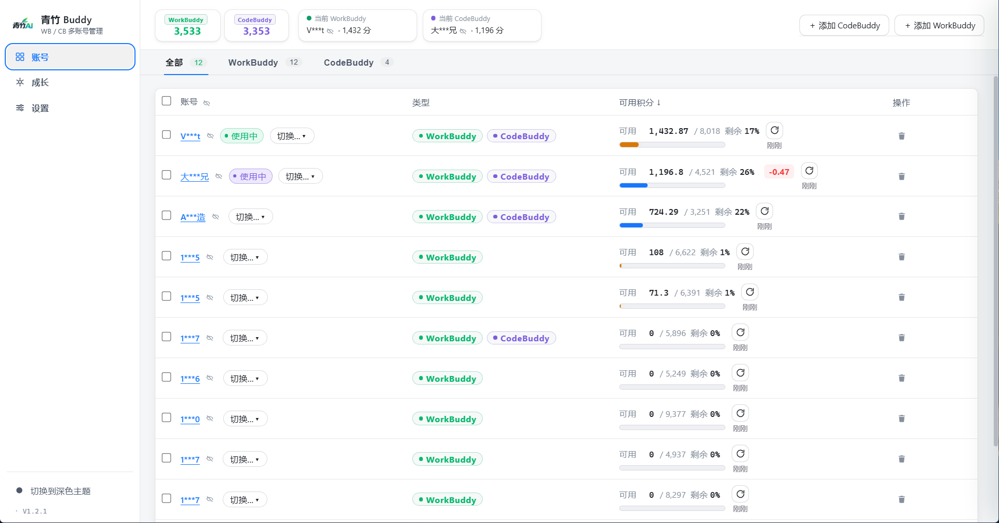

# 青竹 Buddy · Qingzhu Buddy

> **多账号，用一扇窗管清楚。**
> Windows / macOS / Linux 桌面小工具，批量管理 WorkBuddy 与 CodeBuddy 多账号 —— 批量签到、查积分、一键切换客户端账号。

📦 **本仓库仅用于产品介绍与下载（公开仓库，不含源码）。**
源码仓库为私有，本仓库所有安装包由私有仓的 GitHub Actions 自动推送过来，版本号完全同步。

👉 **[产品官网](https://qingzhu-ai-public.github.io/workbuddy-account-manager-public/)** · **[全部 Releases](https://github.com/qingzhu-ai-public/workbuddy-account-manager-public/releases)**

---

## 下载

访问 [Releases 页](https://github.com/qingzhu-ai-public/workbuddy-account-manager-public/releases) 下载对应平台的安装包：

| 平台 | 推荐产物 | 备注 |
|---|---|---|
| **Windows** x64 | `.exe`（NSIS 安装向导） | 双击安装，自动创建桌面与开始菜单快捷方式 |
| **macOS** | `.dmg`（universal） | Apple Silicon 与 Intel 通吃；首次打开右键"打开"即可（未签名） |
| **Linux** x64 / arm64 | `.AppImage` / `.deb` / `.rpm` | AppImage 无需安装，赋予可执行权限即可双击运行 |

> ⚠️ **备份提醒**：导出文件含明文 token，请妥善保管，**不要外传或公开发布**。

---

## 核心能力

- **多账号批量导入** —— `.info` 文件一键解析，按 `uid` 去重（保留过期更晚那份）
- **幂等批量签到** —— 今日已签自动跳过，绝不重复领积分
- **可用性检测** —— 查积分时附带发 hi 心跳，正常回复 = 可用，失效账号自动置灰
- **一键切换客户端账号** —— 自动备份原登录态 + 可回滚（CodeBuddy 解密 Electron safeStorage 密文）
- **WorkBuddy × CodeBuddy 同管** —— 同一份账号库同时管理两套积分体系
- **导出 / 导入备份** —— 完整登录态 JSON，换电脑迁移一步到位

---

## 快速上手

1. 下载安装对应平台的安装包并启动
2. 选择 WorkBuddy 的 `auth/*.info` 目录或单个 `.info` 文件导入账号
3. 点击「更新全部」批量同步签到 + 积分 + 可用性
4. 选定目标账号 → 点击「切换」→ 自动备份原登录态 → 秒级写入客户端

---

## 截图

多账号列表 · 批量签到 · 积分与可用性一览 · 一键切换客户端登录

> 完整产品预览见 [产品官网](https://qingzhu-ai-public.github.io/workbuddy-account-manager-public/)。

---

## 免责声明

本工具仅供学习与技术交流，请遵守目标平台的服务条款。
导出的备份文件含明文 token，**请妥善保管、切勿外传或公开分享**。

---

## License

[MIT](LICENSE)